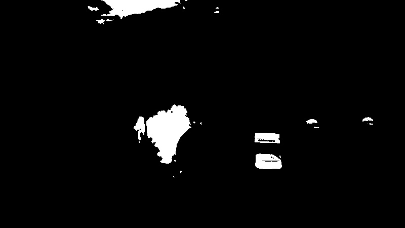
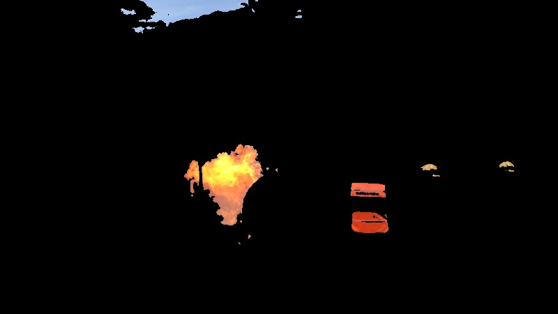

# Fire detection

The proposed algorithm consists of an intersection between a color classifier and a neural network used to classify small regions of the image, resulting in a more precise image segmentation.

## Color classifier

<!-- Color classifier mask:  -->

<!--  -->

<!-- Output: -->

<!--  -->

## Neural network

## Intersection
<!-- ## Algoritmos

Os algortimos implementados foram:

- Irrevogável;

- Backtracking;

- Busca em Largura;

- Busca em Profundide;

- Busca Ordenada;

- A\*;

- IDA\*

## Execução

Para rodar executar o programa basta acessar o terminal na pasta do projeto e executar o comando:

`python main.py`

e o programa irá rodar todos os algoritmos de busca 10 vezes para cada instância, sendo essas de tamanho 25, 50, 100 e 200. Os resultados serão armazenados em "results.csv" na pasta "outputs". -->

<!-- table example -->
<!-- | Model Checkpoint    | Million Parameters | Val Top-1 | Val Top-5 |
| ------------------- | ------------------ | --------- | --------- |
| NASNet-A_Mobile_224 | 5.3                | 70.2      | 89.4      |
| NASNet-A_large_331  | 88.9               | 82.3      | 96.0      | -->
